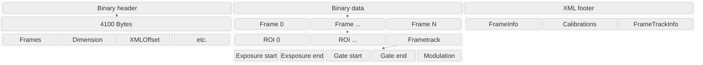

# SPE file structure

`spexread` is made to read data from Princeton Instruments SPE files, supporting both the modern format made by LightField (SPE version 3.0) and legacy files created by WinSpec (SPE version 2.x).

The main difference between the modern version 3.0 format are:

* Structured metadata is stored in an XML footer at the end of the file
* Each binary `Frame` block can now contain tracking metadata at the end.

