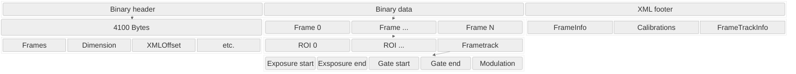

# SPE file structure

`spexread` is made to read data from Princeton Instruments SPE files, supporting both the modern format made by LightField (SPE version 3.0) and legacy files created by WinSpec (SPE version 2.x).

The main difference between the modern version 3.0 format are:

* Structured metadata is stored in an XML footer at the end of the file
* Each binary `Frame` block can now contain tracking metadata at the end.

The overal structure of a file can be described according to the following block diagram.

```mermaid
%%{init: { "theme":"neutral","themeVariables": { "fontSize":"32px" }}}%%
block-beta
columns 3
  block:File:3
    Header("Binary header")
    Binary("Binary data")
    Footer("XML footer")
  end
  Header--> HeaderBlock("4100 Bytes")
  block:Bin
    Frame1("Frame 0")
    Frame2("Frame ...")
    Frame3("Frame N")
  end
  block:XMLMeta
    FrameInfo
    Calibrations
    FrameTrackInfo
  end
  Binary --> Bin
  block:HeaderInfo
    Frames
    Dimension
    XMLOffset
    etc.
  end
  block:Frameblock
    ROI1("ROI 0")
    ROI2("ROI ...")
    Frametrack
  end
  Bin --> Frameblock
  space
  space
  block:FrameMeta
  exsposure_start("Exposure start")
  exsposure_end("Exsposure end")
  gate_start("Gate start")
  gate_end("Gate end")
  modulation("Modulation")
  end
  Frametrack-->FrameMeta
```

## The SPE file header

Both legacy (WinSpec) and modern (LightField) file formats start immediately with a fixed-length header block of 4100 bytes, so there is no magic byte or other identifier.

For legacy WinSpec file formats (SPE version < 3.0), this header contains all the metadata required to read the file and describe acquisition settings.

`Spexread` assumes the header to be compatible with version SPE version 2.x, as described by the Princeton Instruments migration guide to SPE 3.0.

For files using an older version of the format, some fields in the header may be interpreted slightly differently.

File reading should still work, but this is not tested.

For files created by LightField, the header contains only minimal relevant information about the file.

Most importantly it stores the `XMLOffset` which is the byte position in the file where the XML footer starts.

## The XML footer

The XML footer is a part of XML formatted data at the end of each SPE version 3.0 file.

This footer supercedes the file header as the storage location for metadata.

Instead of the fixed-length header, this footer can be of arbitrary size and stores information as a deeply nested hierarchy.

The most relevant information for correctly reading the binary file contents are stored under the `DataFormat`, `MetaFormat` and `Calibrations` tags.

The `DataFormat` tag specifies the size and stride for each frame and region-of-interest.

The `MetaFormat` tag specifies the per-frame tracking metadata (gate time, gate width, etc.) stride, resolution etc..

This tracking metadata, if present, is stored after each frame in the binary data block.

Finally, the `Calibrations` tag contains mostly optional information that describes the wavelength calibration and mapping of regions-of-interest to sensor dimensions.
